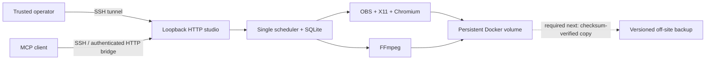

# Repository and VPS audit — 25 September 2026

## Verdict

The hardened, loopback-only VPS is sufficient for the current **single trusted operator** workflow. It is not a sufficient durability design while the Docker volume is the only evidenced copy of recordings. Keep compute, OBS, browser automation, FFmpeg, HTTP, MCP, and scheduling on the VPS; add one tested off-site backup or provider snapshot before treating irreplaceable masters as durable.

Do not add Bunny CDN, Cloudflare CDN/WAF/Workers/Queues/Durable Objects, a public origin, or a second scheduler now. R2 is the leading off-site-backup candidate; Bunny Storage is a reasonable alternative. Neither was provisioned in this audit.

## Scope and evidence boundaries

- Source review covered the application, HTTP and MCP surfaces, SQLite state, OBS adapters, Chromium egress proxy, media processes, Docker image/Compose files, forced-command deploy script, and GitHub Actions workflow.
- Local Windows validation used Node 24, real FFmpeg/FFprobe, real Chromium, real HTTP, and the official MCP SDK. OBS protocol tests use mock WebSocket clients unless explicitly identified otherwise.
- Live evidence comes from the protected GitHub deployment run and the checked-in VPS acceptance records. The accepted VPS run used real OBS 32.2.2, obs-websocket 5.7.4, X11/Chromium, FFmpeg, authenticated HTTP, and the persistent volume. Direct general-purpose SSH was intentionally unavailable to the audit identity.
- No paid provider request ran. No infrastructure was provisioned. No project, recording, credential, or `runtime.env` file was read, changed, or deleted.

## Prioritized findings

| Severity | Finding and reproduction | Root cause / impact | Resolution and evidence |
| --- | --- | --- | --- |
| High | `npm audit` reported seven high-severity development dependency findings through the packaging chain. Run full `npm audit` on the prior lockfile. | The CI gate checked production dependencies only. A compromised build dependency can still affect generated artifacts. | Updated `electron-builder` to 26.15.3 and `esbuild` to 0.28.2; added full audit to CI. Full and production audits now report zero known vulnerabilities. |
| High | Loss of the VPS or Docker volume could lose every project and master. Search deployment/source/evidence for a second copy or restore drill. | No repository configuration or acceptance evidence establishes an off-site backup. A persistent volume survives container replacement, not host loss, operator deletion, or provider failure. | Open operational requirement. Add a versioned off-site copy or provider snapshot and test restore without deleting the volume. |
| Medium | Recovery could mark a recording failed when OBS returned from `StopRecord` before the MKV became stable and FFprobe-readable. | Recovery probed immediately, racing filesystem/OBS finalization. | Recovery now waits for a stable, playable master. Regression test delays the file copy and uses real FFprobe. |
| Medium | Reusing an existing OBS display input could produce a blank recording. | Setup updated the input but did not guarantee a scene item existed, was enabled, and had the intended transform. | Setup now creates or reattaches, enables, and transforms the reused input. Mock OBS regression verifies the calls. |
| Medium | The desktop OBS adapter failed to restore a snapshot when only the profile or only the scene collection changed. | Restore used `profileChanged && collectionChanged` instead of `||`. | Corrected condition and regression test. |
| Medium | Narrated composition could fail on Windows with an `Impossible to open` error. | FFmpeg concat entries were relative to the list file while values were generated relative to the process directory. | Concat lists now use normalized absolute paths. Real Windows FFmpeg composition passed. |
| Medium | Local walkthrough URL checks accepted CGNAT and documentation ranges that the server egress proxy rejected. | Desktop and server maintained different address classifiers. | Both now use the same public-address policy; regression covers CGNAT, RFC 5737, loopback, RFC 1918, ULA, and IPv4-mapped addresses. |
| Medium | A video uploaded to the studio could not use **Prepare master MP4** unless it originated as an OBS `master`. | Remux selected only `data.master`, ignoring `data.video`. | Remux now accepts a master or imported/captured video; focused service regression added. |
| Medium | Main protection requires the CI check but zero approving reviews; repository administrators may bypass it. | GitHub branch settings permit one-person merge and do not enforce rules for admins. | Open governance risk. Require one approval and enforce rules for administrators if operational ownership permits. This is a repository-setting change, not an application patch. |
| Medium | Base images are tag-pinned rather than digest-pinned. | A mutable upstream tag can change the build without a source change. | Open supply-chain hardening item. Pin reviewed digests and schedule deliberate refreshes. |
| Medium | There is no per-project/total retention quota, incomplete-upload TTL cleanup, storage alert, or restore drill. | Upload admission checks current reservations and free space, but abandoned partials and retained masters grow indefinitely by design. | Open operational item. Add metrics/alerts and non-destructive cleanup policy; never auto-delete masters. Incomplete uploads may be expired only with an explicit, documented policy. |
| Medium | The shared studio token gives every authenticated session and MCP client access to every project. | The product is single-tenant and project IDs are not authorization boundaries. | Acceptable only for trusted single-operator use. Add identity and per-project authorization before multi-user exposure. Cloudflare Access alone does not implement project isolation. |
| Low | Upload verification showed a cancel control although that phase cannot be interrupted safely. | UI inferred cancellability from “active job” alone. | Scheduler exposes `cancellable`; UI hides cancel for verification. Regression test covers both states. |
| Low | Recovery and voice-replacement controls were offered when their prerequisites were absent. | UI did not bind controls to OBS/state/file/narration prerequisites. | Recovery is shown only for an interrupted/failed OBS project with a retained MKV; voice/render controls are disabled until their inputs exist. Browser acceptance checks the unavailable state. |
| Low | Browser acceptance scripts failed in a clean clone if ignored `work/` did not exist, and evidence mislabeled Windows as Linux. | Test setup assumed a developer-created directory and hard-coded the platform boundary. | Scripts create the directory and record `process.platform`. |
| Low | The historical Windows-packaging workflow is nested under the application, so GitHub does not execute it from the repository root. | GitHub discovers workflows only under the root `.github/workflows`. | Open verification gap. The production server pipeline is active; native Windows installer validation remains separate and unverified in this audit. |
| Low | `npm ci` warns that the browser hash worker's direct `crypto-js` dependency is no longer maintained; several packaging transitive packages are also deprecated. | No currently reported vulnerability exists, but unsupported dependencies increase future maintenance risk. | Open maintenance item. Replace the incremental browser hash implementation with a maintained streaming implementation, then remove `crypto-js`; refresh packaging transitives through supported upstream releases. |

## Security and reliability controls that passed review

- HTTP binds to loopback. Login uses a high-entropy shared token, timing-safe comparison, an in-memory 12-hour session, `HttpOnly`/`SameSite=Strict` cookies, exact Host/Origin checks for mutations, a restrictive CSP, and `nosniff`.
- Downloads are authenticated, `no-store`, range-capable, and constrained to regular non-symlink project files. Absolute paths, traversal, Windows alternate data streams, and symlink escape are rejected.
- Uploads use 8 MiB chunks, explicit offsets, final SHA-256 verification, restart persistence, idempotent completion, free-space admission, and reservation accounting. Existing originals are never replaced.
- Media commands use argument arrays with `shell:false`, stage partial files, probe outputs, and publish under new filenames. Cancellation preserves source and prior valid output.
- SQLite uses WAL, a busy timeout, and atomic state claims. One in-process server scheduler serializes capture/render work; database claims prevent a second process from replacing active project state.
- Chromium keeps its sandbox, uses an ephemeral profile, disables downloads/service workers, receives a filtered environment, and reaches the network through a DNS-pinning proxy limited to checked public HTTP/HTTPS destinations. This is SSRF containment, not a general outbound firewall.
- The container runs non-root with a read-only root filesystem, `no-new-privileges`, PID/CPU/memory limits, bounded JSON logs, all capabilities dropped, and only `SYS_CHROOT` restored for the Chromium sandbox. HTTP and OBS WebSocket are not published beyond loopback/container scope.
- Deployment actions and third-party actions are commit-SHA pinned. Pull-request code receives no deployment secret. The forced SSH command validates archive size/type/path/link rules, preserves `runtime.env` and the named volume, performs a health gate, and rolls source/image back on failure.

## Tests and observations

| Test | Result | Boundary |
| --- | --- | --- |
| Node regression suite | 32 passed, 0 failed | Includes real FFmpeg/FFprobe; OBS protocol clients are mocked. |
| Browser studio acceptance | Passed | Real local Windows HTTP, Chrome, upload hashing, FFmpeg render, downloads, responsive UI, and no page exceptions. |
| Asynchronous capture acceptance | Passed | Real local Chrome/HTTP/FFmpeg against a deterministic fixture; not live VPS OBS. |
| MCP acceptance | Passed | Official SDK stdio child → authenticated HTTP → shared scheduler → FFmpeg output on Windows. |
| Live VPS acceptance | Passed in checked-in evidence | Real public-site X11/Chromium/OBS capture, authenticated download, render, MCP, and restart recovery. |
| Current protected deployment | Healthy before changes | Main revision and container health confirmed from GitHub Actions logs. |

## Storage assumptions and cost comparison

The live static-page sample produced 4.36 MB in 5.9 seconds, about 2.66 GB/hour. This is not a workload benchmark. Planning uses **3 GB per retained master hour plus 1 GB/hour for rendered output and evidence**, or 4 GB per retained hour.

| Scenario | Retained media | Monthly downloads | Current VPS volume | Bunny Storage, 1 region | Bunny Storage, 2 regions | Cloudflare R2 Standard |
| --- | ---: | ---: | --- | ---: | ---: | ---: |
| Light: 10 retained hours | 40 GB | 20 GB | $0 marginal while included capacity remains; host-loss risk remains | $0.40 usage, billed at Bunny's $1 monthly minimum | $0.80 usage, still $1 minimum | About $0.45 after 10 GB free, plus negligible operations |
| Moderate: 100 retained hours | 400 GB | 200 GB | $0 marginal until capacity/backup tier changes; requires monitoring | About $4/month | About $8/month | About $5.85 plus operations |

Assumptions exclude taxes, minimums shared with other zones, request-class charges, storage-duration rounding, VPS disk upgrades, and provider backup pricing. R2 download egress is free; R2 operations are metered after its free tier. Bunny Storage API egress is free and transfers to Bunny CDN are free; CDN delivery is separately metered. Current official prices: [Bunny Storage](https://bunny.net/pricing/storage/), [Bunny CDN](https://bunny.net/pricing/), and [Cloudflare R2](https://developers.cloudflare.com/r2/pricing/).

## Bunny decision matrix

| Service | Classification | Exact problem / evidence | Security, complexity, cost, migration, code |
| --- | --- | --- | --- |
| Storage as off-site backup | **Recommended later; operational backup required now** | The named Docker volume is the only evidenced durable copy. | Private zone credentials become a new secret and deletion/rotation procedure. A background copy plus checksum/restore drill is needed. Start copy-only, retain VPS primary, and roll back by disabling the uploader. Application code or an external backup job is required. One region is $0.01/GB-month with a $1 account minimum; replication multiplies storage cost. |
| Storage as primary media store | Optional, not justified now | The local volume gives low-latency POSIX access required by OBS/FFmpeg, and current scale has no cross-host requirement. | Object storage adds staging, retry, cache, lifecycle, outage, and credential behavior. Migrate only after backup operation is proven; keep local working files and a reversible dual-write period. Significant code change. |
| CDN for completed downloads | **Not needed** | Downloads are private, authenticated, range-capable, and expected traffic is small. | Caching private recordings increases exposure risk. If later used, bypass cache by default and use short-lived signed URLs; do not make the zone public. Current volume-tier CDN begins at $0.005/GB, while regional standard rates vary. Code/config change required. |
| Signed/expiring URLs | Optional | Current application sessions already authorize loopback downloads; there is no direct object delivery. | Useful only if delivery leaves the authenticated app. Treat URLs as bearer secrets and keep expiries short. Bunny documents HMAC token authentication and range support: [advanced token auth](https://bunny.net/docs/cdn/security/token-authentication/advanced.md), [range requests](https://bunny.net/docs/cdn/frequently-asked-questions/range-requests.md). |
| Multi-region replication | Recommended later for irreplaceable masters | One remote region protects the VPS, but not the storage provider/region or credential-driven deletion. | A second region doubles the first-two-region storage charge. Version/retention controls and an independent restore path matter more than CDN caching. No app change if implemented by backup policy. |

Bunny's generic Storage HTTP API documentation does not establish a native resumable protocol equivalent to R2 multipart upload for this use case. Treat resumability as an application chunk/retry responsibility until a proof against the selected API is completed.

## Cloudflare decision matrix

| Service | Classification | Exact problem / evidence | Security, complexity, cost, migration, code |
| --- | --- | --- | --- |
| DNS | Optional | No public hostname is required for the SSH-tunnel workflow. | Needed only with a chosen public hostname. DNS alone does not expose the app. No app change. |
| Tunnel | Recommended later for multiple remote users | SSH tunneling is adequate for one trusted operator but awkward to distribute and revoke per user. | Tunnel is outbound-only and removes a public inbound service, but deliberately makes the studio reachable through Cloudflare. Roll out beside SSH, restrict hostname, then remove it to roll back. Set exact `COMPANION_ORIGINS`/Host values; no core code change. [Tunnel model](https://developers.cloudflare.com/cloudflare-one/networks/connectors/cloudflare-tunnel/) |
| Access | Recommended later with Tunnel | The shared app token has no identity, user revocation, or audit trail. | Adds an identity gate but does **not** add per-project authorization. Preserve application auth as defense in depth during migration. Access is free for under 50 users; paid Access is currently $7/user/month. [Access](https://www.cloudflare.com/sase/products/access/) |
| WAF / rate limiting / DDoS | **Not needed now** | There is no public HTTP origin; loopback and SSH are the boundary. | Becomes relevant only after deliberate public/Tunnel exposure. Avoid duplicating controls before then. Free plans have limited managed/rate rules. [WAF](https://developers.cloudflare.com/waf/) |
| R2 off-site backup | **Recommended later; leading candidate** | Same missing-copy evidence as Bunny Storage. | Supports multipart retry, presigned bearer URLs, encryption at rest/TLS, and no download egress fee. Default lifecycle aborts incomplete multipart uploads after seven days. Start copy-only and checksum/restore; roll back by stopping copies while leaving VPS data intact. Backup job/app code required. [uploads](https://developers.cloudflare.com/r2/objects/upload-objects/), [presigned URLs](https://developers.cloudflare.com/r2/api/s3/presigned-urls/), [durability](https://developers.cloudflare.com/r2/reference/durability/), [security](https://developers.cloudflare.com/r2/reference/data-security/) |
| Workers for signed routing | **Not needed** | The application already authenticates and streams private ranges; R2 can issue presigned S3 URLs directly if later needed. | Adds runtime, logs, routing, failure modes, and at least a $5/month paid-plan floor when paid features are needed. No migration warranted. |
| Queues | **Not needed** | One scheduler intentionally serializes heavy OBS/FFmpeg work on one host. | A remote queue cannot add compute capacity or SQLite/project isolation and would duplicate state. Add only with multiple workers and idempotent object-backed jobs. |
| Durable Objects | **Not needed** | There is no horizontally distributed coordination problem. | Duplicates SQLite locks and the scheduler. Required only after a deliberate multi-worker redesign. |
| CDN proxy/cache | **Not needed** | Private downloads are `no-store`; expected transfer is modest. | Proxying can terminate long connections and WebSockets during Cloudflare maintenance. Free/Pro upload limits are 100 MB, but existing 8 MiB upload chunks fit; origin read timeout is 125 seconds, so range/chunk retry remains important. Keep recordings uncached. [cache behavior](https://developers.cloudflare.com/cache/concepts/default-cache-behavior/), [limits](https://developers.cloudflare.com/fundamentals/reference/connection-limits/), [WebSockets](https://developers.cloudflare.com/network/websockets/) |

## Architecture now and later

At likely future scale, retain local scratch/master files for active OBS/FFmpeg jobs, copy immutable outputs to R2 or Bunny Storage, and serve private objects only through the application or short-lived URLs. For multiple remote users, add Cloudflare Tunnel + Access in front of the existing app **after** implementing application identities and project authorization. Introduce a queue/coordinator only when compute is split across multiple workers.

## Migration and rollback sequence for the one required capability

1. Choose R2, Bunny Storage, or a VPS-provider snapshot product using approved credentials and retention rules.
2. Copy only completed immutable masters/outputs; do not move or delete the volume copy.
3. Record object checksum, size, project ID, and upload state locally. Retry multipart/chunk failures idempotently.
4. Restore a sample to a new path, verify SHA-256 and FFprobe, and document recovery time.
5. Alert on backup age, failures, free local disk, and remote retention changes.
6. Roll back by disabling new uploads and continuing from the untouched volume. Remote deletion is a separate, explicitly authorized operation.

## Remaining unverified risks

- No destructive disk-full test, sustained 40-minute OBS run, concurrent-user load test, or orphan-process chaos test ran on production.
- No independent volume restore, host-loss recovery, monitoring/alert delivery, or backup retention proof exists.
- Native Windows installer, physical camera/microphone/audio routing, SSH from a named GUI MCP client, and paid-provider behavior remain outside this audit.
- Live post-change OBS recording was intentionally not started. Post-deploy verification is limited to HTTP health, authenticated OBS version/readiness, inactive recorder/streamer status, container health, and the deployment script's volume-identity invariant.
- Container image tags and npm trust remain supply-chain dependencies; zero audit findings is not a security certification.
- One container is a single failure domain. This is acceptable for current scale, not high availability.

## Infrastructure explicitly not needed now

Bunny CDN; Cloudflare public CDN/cache; WAF/rate limiting/DDoS products; Workers; Queues; Durable Objects; a public OBS WebSocket; a public VPS HTTP port; a second scheduler; Kubernetes; a separate media worker fleet; and object storage as the primary active-edit filesystem.
